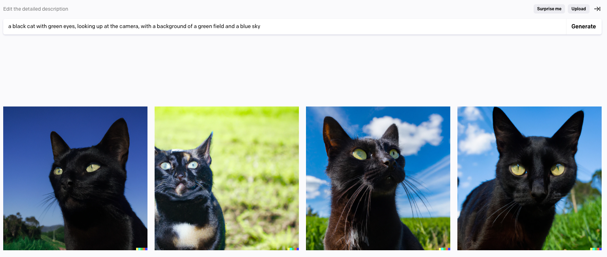

# prompt-generator
Using LLMs to amplify input prompts for image generation tools (DALL-E 2, Stable Diffusion).

Note: fine-tuned model is inconsistent in generated outputs, more work required. This is just a concept demo of LLM-enabled prompt generation.

# Results

### Non-Fine-Tuned Prompt:

### Fine-Tuned Prompt:

